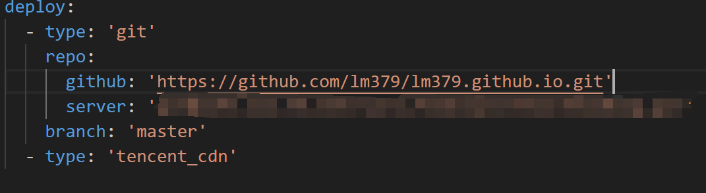
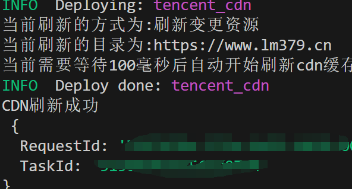

## hexo腾讯云CDN提交刷新插件

基于最新的腾讯云CDN API 3.0开发，解决API 2.0接口下线出现的问题

支持两种刷新方式：变更资源和全部资源

若你的CDN源站为Vercel,Netlify,Github Pages等，建议将timer字段设置为60000（1分钟）以上，以免刷新失败

### 使用方法

进入腾讯云后台创建API密钥（建议使用子用户密钥）

[https://console.cloud.tencent.com/cam/capi](https://console.cloud.tencent.com/cam/capi)

回到hexo博客根目录，打开Git Bash执行

```bash
npm install hexo-cdn-Purge --save
```

然后在站点的_config.yml中添加配置

> 注意不是主题的_config.yml

```ymal
tencent_cdn:
 secretId: your secretId # 你在https://console.cloud.tencent.com/cam/capi 获取到的SecretId
 secretKey: your secretKey # 你在https://console.cloud.tencent.com/cam/capi 获取到的SecretKey
 FlushType: flush # 刷新方式,flush为只刷新变更资源,delete为刷新网站下的全部缓存
 timer: 60000 # 延时器,单位为毫秒,延时多长时间再执行刷新命令,不需要的填写0
 PurgePath: https://www.example.com # 需要刷新的链接，不支持多个，必须有http或者https协议头
```

deploy字段最后面添加，如下图

```ymal
 type: tencent_cdn
```



后续在执行 `hexo d`的时候就会同时对CDN进行刷新

### 效果图



### 常见错误代码

来源：[腾讯云官方文档](https://cloud.tencent.com/document/api/228/37871)

| 错误码                                      | 描述                                         |
| ------------------------------------------- | -------------------------------------------- |
| AuthFailure.InvalidAuthorization            | 鉴权错误，请确认后重试。                     |
| InternalError.CamSystemError                | 内部鉴权系统错误。                           |
| InternalError.CdnConfigError                | 域名配置更新失败。                           |
| InternalError.CdnDbError                    | 内部数据错误，请联系腾讯云工程师进一步排查。 |
| InternalError.CdnQueryParamError            | 内部查询错误，请重试或联系客服人员解决。     |
| InternalError.CdnQuerySystemError           | 内部查询错误，请重试或联系客服人员解决。     |
| InternalError.CdnSystemError                | 系统错误，请联系腾讯云工程师进一步排查。     |
| InternalError.Error                         | 内部服务错误，请联系腾讯云工程师进一步排查。 |
| InternalError.ProxyServer                   | 内部服务错误，请联系腾讯云工程师进一步排查。 |
| InvalidParameter.CdnHostInvalidStatus       | 域名状态不合法。                             |
| InvalidParameter.CdnInterfaceError          | 内部接口错误，请联系腾讯云工程师进一步排查。 |
| InvalidParameter.CdnParamError              | 参数错误，请参考文档中示例参数填充。         |
| InvalidParameter.CdnPurgeWildcardNotAllowed | 刷新不支持泛域名。                           |
| InvalidParameter.CdnStatInvalidDate         | 日期不合法，请参考文档中日期示例。           |
| InvalidParameter.CdnUrlExceedLength         | URL 超过限制长度。                           |
| LimitExceeded.CdnPurgeExceedBatchLimit      | 刷新的Url数量超过每批提交的限制。            |
| LimitExceeded.CdnPurgeExceedDayLimit        | 刷新的Url数量超过每日限额。                  |
| LimitExceeded.CdnPurgePathExceedBatchLimit  | 刷新的目录数量超过限制。                     |
| LimitExceeded.CdnPurgePathExceedDayLimit    | 刷新的目录数量超过每日限制。                 |
| LimitExceeded.CdnPurgeUrlExceedBatchLimit   | 刷新的Url数量超过限制。                      |
| LimitExceeded.CdnPurgeUrlExceedDayLimit     | 刷新的Url数量超过每日限额。                  |
| ResourceNotFound.CdnHostNotExists           | 未查询到该域名，请确认域名是否正确。         |
| ResourceNotFound.CdnUserNotExists           | 未开通CDN服务，请开通后使用此接口。          |
| UnauthorizedOperation.CdnCamUnauthorized    | 子账号未配置cam策略。                        |
| UnauthorizedOperation.CdnHostUnauthorized   | CDN子账号加速域名未授权。                    |
| UnauthorizedOperation.CdnUserAuthFail       | CDN用户认证失败。                            |
| UnauthorizedOperation.CdnUserAuthWait       | CDN用户待认证。                              |
| UnauthorizedOperation.CdnUserIsSuspended    | 加速服务已停服，请重启加速服务后重试。       |
| UnauthorizedOperation.OperationTooOften     | 操作超出调用频次限制。                       |

欢迎提交issue
